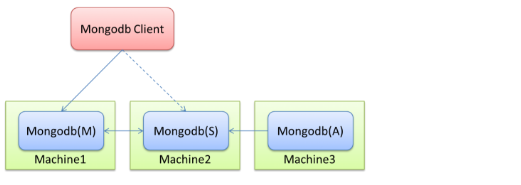

# MongoDB复制

> 2018-07-31 

[TOC]

之前介绍了MongoDB的备份分冷备和热备，ReplicaSet的架构就是实现热备的技术，可以在瞬间恢复数据库服务。但是不能解决人为误操作。

## 什么是ReplicaSet

### 副本集的组成

 

| 节点角色 | 存储数据 | 提供连接 | 写请求 | 读请求 |
| -------- | -------- | -------- | ------ | ------ |
| 主节点   | √        | √        | √      | √      |
| 备节点   | √        | √        | ×      | ×      |
| 仲裁节点 | ×        | ×        | ×      | ×      |


* 主备节点存储数据，仲裁节点不存储数据。客户端同时连接主节点与备节点，不连接仲裁节点。 
* 仲裁节点是一种特殊的节点，它本身并不存储数据，主要的作用是决定哪一个备节点在主节点挂掉之后提升为主节点，所以客户端不需要连接此节点。
* 在MongoDB副本集中，主节点负责处理客户端的读写请求，备份节点则负责映射主节点的数据。

### 备份节点的工作原理

1. `Primary`上执行数据库状态改变操作，并记录于`operation log`中即`oplog`
2. `Secondary`同步`Primary`的`oplog`并重演

`oplog`存储在`local`数据库的`oplog.rs`表中。

### `Oplog`

Oplog的大小是固定的，当集合被填满的时候，新的插入的文档会覆盖老的文档。

通过`oplog`同步数据的过程：

>  这个过程发生在当副本集中创建一个新的数据库或其中某个节点刚从宕机中恢复，或者向副本集中添加新的成员的时候，默认的，副本集中的节点会从离它最近的节点复制oplog来同步数据，这个最近的节点可以是primary也可以是拥有最新oplog副本的secondary节点。

一个复制集至少需要这几个成员：一个 [*主节点*](http://www.mongoing.com/docs/core/replica-set-members.html#replica-set-primary-member) ，一个 [*从节点*](http://www.mongoing.com/docs/core/replica-set-members.html#replica-set-secondary-members) ，和一个 [*投票节点*](http://www.mongoing.com/docs/core/replica-set-members.html#replica-set-arbiters) 。但是在大多数情况下，我们会保持3个拥有数据集的节点：一个 [*主节点*](http://www.mongoing.com/docs/core/replica-set-members.html#replica-set-primary-member) 和两个 [*从节点*](http://www.mongoing.com/docs/core/replica-set-members.html#replica-set-secondary-members) 。

## ReplicaSet的原理

## 搭建节点的ReplicaSet

关键配置信息

```shell
replication:
##oplog大小
 oplogSizeMB: 20
##复制集名称
 replSetName: zhou1
```

